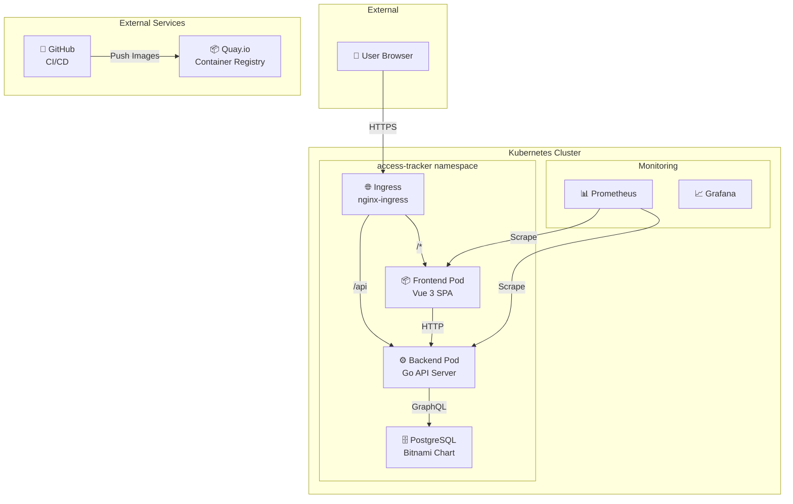
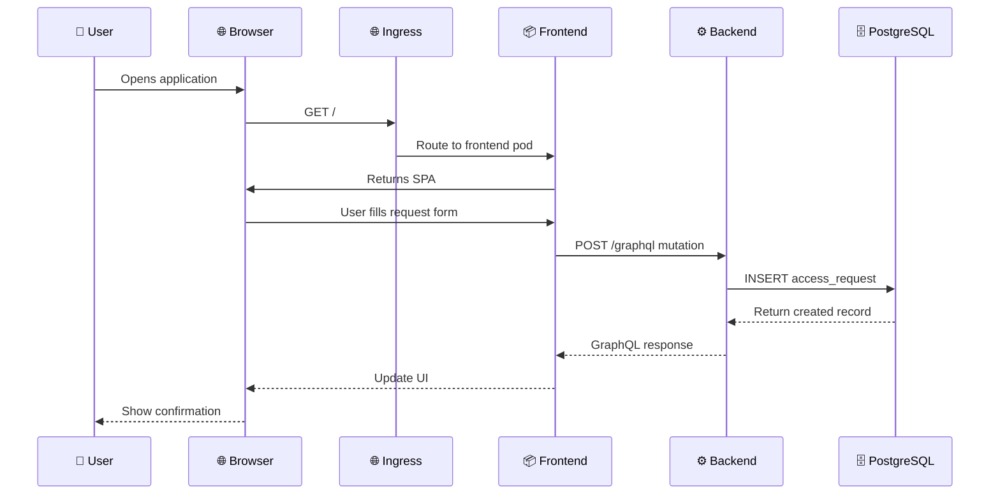
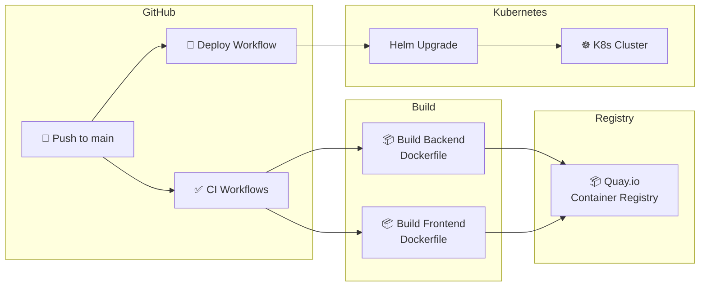
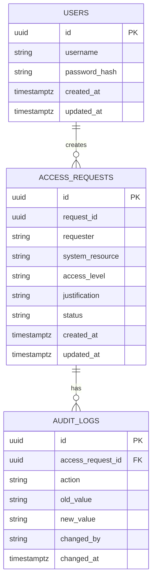
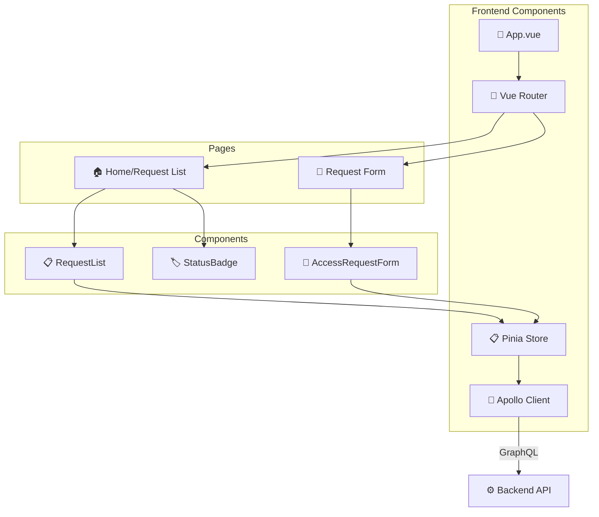
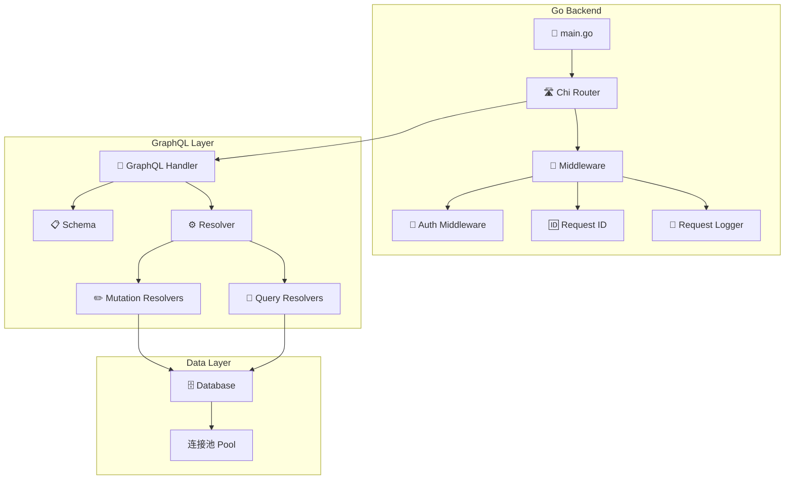
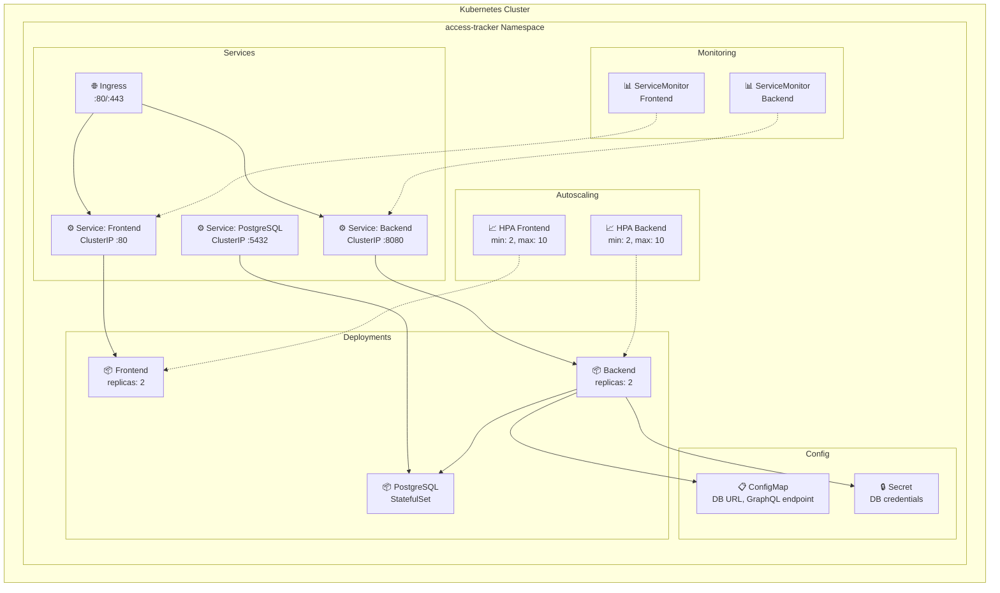
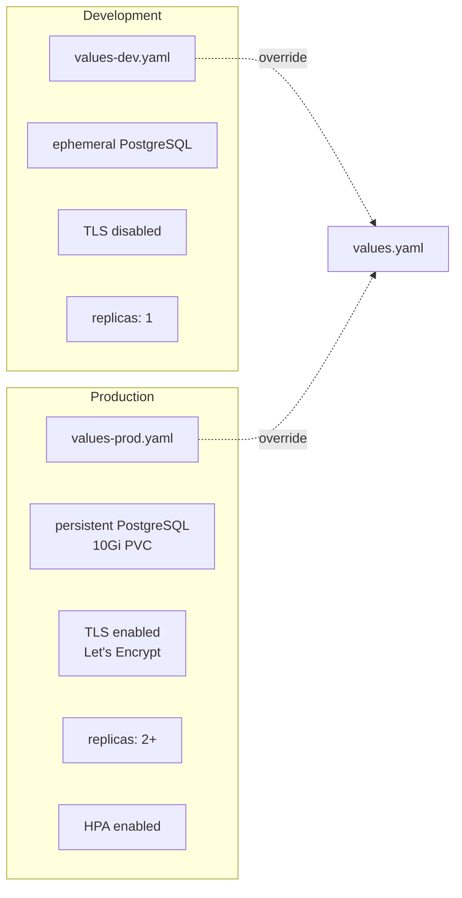
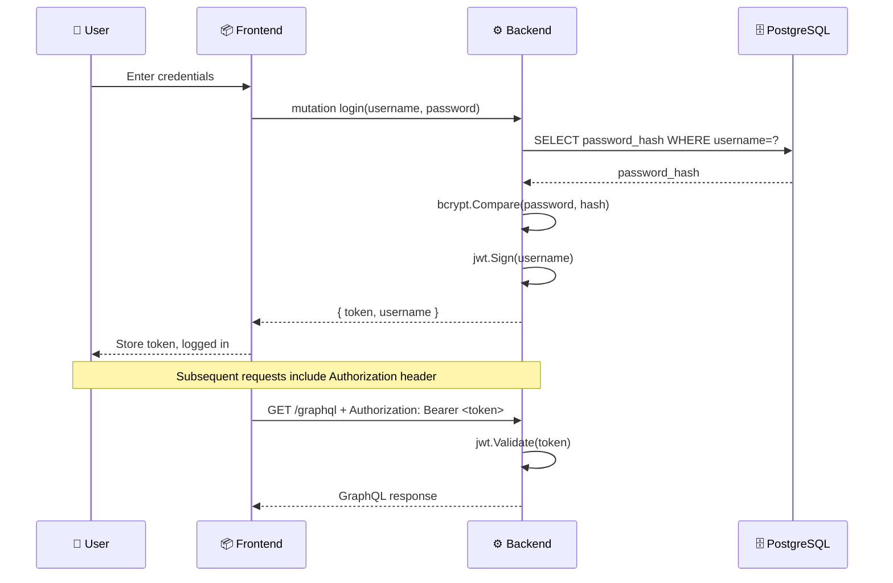

# Access Tracker Architecture

## System Overview

Access Tracker is a system for tracking and managing resource access permissions and logs. The system follows a client-server architecture with:

- **Vue 3 Frontend** - Single Page Application (SPA)
- **Go Backend** - REST API with GraphQL
- **PostgreSQL** - Primary database
- **Kubernetes** - Container orchestration
- **Quay.io** - Container registry

## Component Diagram



## Request Flow Diagram



## CI/CD Pipeline



## Data Model



## Frontend Architecture



## Backend Architecture



## Kubernetes Deployment



## Environment Configuration



## Tool Selection Rationale

### Go (Backend)

| Reason | Benefit |
|--------|---------|
| Performance | Excellent for API workloads with minimal memory footprint |
| Concurrency | Built-in goroutines for handling multiple simultaneous connections |
| Deployment | Single binary deployment simplifies Kubernetes operations |
| Tooling | Mature ecosystem for web services |

### Vue 3 (Frontend)

| Reason | Benefit |
|--------|---------|
| Developer Experience | Clean `<script setup>` syntax |
| Reactivity | Efficient UI state management |
| TypeScript | First-class integration improves code quality |
| Ecosystem | Mature router, state management, build tooling (Vite) |

### GraphQL (API)

| Reason | Benefit |
|--------|---------|
| Flexible Queries | Clients request exactly the data they need |
| Type Safety | Schema-first development catches errors early |
| Single Endpoint | Simplifies frontend-backend communication |
| Tooling | GraphiQL provides excellent developer experience |

### PostgreSQL (Database)

| Reason | Benefit |
|--------|---------|
| Reliability | ACID compliance and data integrity |
| Bitnami Chart | Easy Kubernetes deployment |
| Performance | Excellent read/write performance |

### Kubernetes + Helm (Infrastructure)

| Reason | Benefit |
|--------|---------|
| Orchestration | Deployment, scaling, health management |
| Helm | Reproducible, versioned deployments |
| HPA | Supports 10x traffic scaling |
| Ingress + Cert-Manager | Automatic TLS |

### Quay.io (Container Registry)

| Reason | Benefit |
|--------|---------|
| Security | Image scanning and vulnerability detection |
| GitHub Actions | Excellent CI/CD integration |

## Project Structure

```
access-tracker/
├── backend/
│   ├── cmd/server/
│   │   └── main.go           # Entry point, router setup
│   └── internal/
│       ├── auth/
│       │   └── auth.go       # JWT + bcrypt utilities
│       ├── db/
│       │   └── conn.go       # PostgreSQL connection pool
│       ├── graphql/
│       │   ├── graphql.go    # Schema, resolvers
│       │   └── server.go     # GraphQL handler
│       └── models/
│           ├── access_request.go
│           └── user.go        # User + AuditLog models
├── frontend/
│   └── src/
│       ├── components/
│       │   ├── AccessRequestForm.vue
│       │   ├── RequestList.vue
│       │   └── StatusBadge.vue
│       ├── apollo.ts         # Apollo/GraphQL client
│       ├── router.ts         # Vue Router config
│       └── main.ts           # Entry point
├── k8s/access-tracker/
│   ├── values.yaml           # Base values
│   ├── values-dev.yaml       # Dev overrides
│   ├── values-prod.yaml     # Prod overrides
│   └── templates/
│       ├── deployment-backend.yaml
│       ├── deployment-frontend.yaml
│       ├── service-backend.yaml
│       ├── service-frontend.yaml
│       ├── ingress.yaml
│       ├── configmap.yaml
│       ├── hpa.yaml          # HorizontalPodAutoscaler
│       └── servicemonitor.yaml # Prometheus
├── .github/
│   ├── workflows/
│   │   ├── backend-ci.yml
│   │   ├── frontend-ci.yml
│   │   ├── deploy.yml
│   │   └── codeql.yml
│   └── dependabot.yml
└── docs/
    ├── architecture.md
    ├── runbook.md
    └── scaling.md
```

## API Reference

### GraphQL Queries

```graphql
# Get all access requests with optional filter
query GetAccessRequests($filter: AccessRequestFilter) {
  accessRequests(filter: $filter) {
    id
    requestId
    requester
    systemResource
    accessLevel
    justification
    status
    createdAt
    updatedAt
  }
}

# Get audit logs for an access request
query GetAuditLogs($accessRequestId: ID!) {
  auditLogs(accessRequestId: $accessRequestId) {
    id
    action
    oldValue
    newValue
    changedBy
    changedAt
  }
}
```

### GraphQL Mutations

```graphql
# Login and get JWT token
mutation Login($input: LoginInput!) {
  login(input: $input) {
    token
    username
  }
}

# Create new access request
mutation CreateAccessRequest($input: CreateAccessRequestInput!) {
  createAccessRequest(input: $input) {
    id
    requestId
    status
  }
}

# Update request status (creates audit log)
mutation UpdateStatus($input: UpdateAccessRequestStatusInput!) {
  updateAccessRequestStatus(input: $input) {
    id
    status
  }
}
```

## Security

### Authentication Flow



### Password Security

- Passwords hashed with **bcrypt** (cost factor 10)
- Tokens signed with **JWT** (HS256)
- `JWT_SECRET` environment variable required in production

## Monitoring

### Metrics Endpoint

The backend exposes metrics at `/metrics` for Prometheus scraping:

```bash
# Prometheus Operator scrapes ServiceMonitor
oc get servicemonitor -n access-tracker

# View metrics directly
kubectl exec -it <backend-pod> -n access-tracker -- wget -O- http://localhost:8080/metrics
```

### Health Checks

| Probe | Endpoint | Purpose |
|-------|----------|---------|
| Liveness | `/healthz` | Pod is alive |
| Readiness | `/healthz` | Pod can serve traffic |
| Startup | `/healthz` | Application initialized |

### Log Aggregation

Logs are written to stdout and collected by OpenShift aggregated logging:

```bash
# View logs via CLI
kubectl logs -l app.kubernetes.io/component=backend -n access-tracker -f

# Via OpenShift Console
# Observe -> Logging
```
